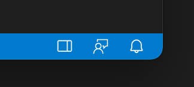

# Side Panel Toggle

An extension for adding an icon to the status bar to toggle the Side Panel. To use the custom icon, you'll have to enable the proposed API by editing `~/.vscode/argv.json` and adding:

```bash
"enable-proposed-api": [
    "miguelsolorio.side-panel-toggle"
]
```

